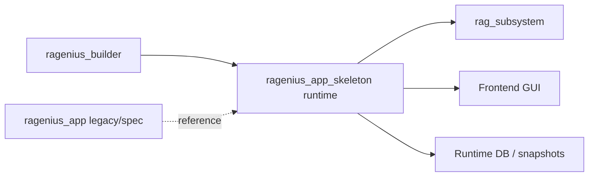

# RAGenius App + Skeleton Handover

Date: 2026-05-24

## 1. High-Level Overview

### Purpose of this subsystem/project

This repository implements a multi-application RAG platform. Within that platform:

- `ragenius_app` is the older application/runtime scaffold and original specification anchor.
- `ragenius_app_skeleton` is the current integrated runtime surface used for active builder-backed chat execution, instruction compilation, session persistence, workflow orchestration, and GUI/runtime inspection.

The immediate purpose of these subsystems is to let the Builder define isolated knowledge/chat applications and let the App runtime execute those applications safely, reproducibly, and with explicit workflow semantics.

### Main responsibilities

`ragenius_app`
- preserve original system specifications, prompt contracts, schema shapes, and legacy scaffold behavior
- provide architectural reference material for planner and workflow intent

`ragenius_app_skeleton`
- serve as the primary active runtime for builder-managed apps
- compile app instructions into executable runtime models
- derive runtime config/adapter state from Builder data
- execute chat workflows through a graph pipeline
- persist chat sessions and workflow status across restarts
- expose backend APIs and frontend runtime inspection surfaces

### Core architectural philosophy

- Builder is the source of truth for app definitions, instructions, settings, and documents.
- Runtime execution is schema-driven and contract-first.
- Retrieval remains isolated in `rag_subsystem`; app layers should not duplicate retrieval logic.
- Instruction understanding is compiled into runtime contracts before execution rather than interpreted ad hoc each turn.
- Application isolation is mandatory: app-scoped sessions, app-scoped retrieval, app-scoped documents.
- Backward compatibility matters. The active runtime still carries compatibility projections and shims where needed.

### How this subsystem fits into the overall system

System position:

- `ragenius_builder`: authoring/control plane
- `ragenius_app_skeleton`: active execution/runtime plane
- `ragenius_app`: reference/legacy scaffold/spec plane
- `rag_subsystem`: ingestion/retrieval plane
- `shared`: reusable cross-cutting modules

The Builder produces app state. `ragenius_app_skeleton` consumes that state, compiles instructions, executes workflows, calls retrieval through `rag_subsystem`, and returns chat/UI payloads. `ragenius_app` remains useful for understanding the original intended orchestration and prompt contracts, but it is no longer the main runtime.

## 2. Current Architecture

### Major modules/components

#### `ragenius_app`

- `01_system_specs/`: original architecture/spec documents
- `03_llm_prompts/`: legacy planner and answer prompts
- `04_function_schemas/`: function-call schemas
- `05_json_schemas/`: JSON output contracts
- `backend/app/main.py`: older FastAPI scaffold
- `workflows/nodes/planner.py`: older prompt-driven planner implementation

Role today:
- legacy scaffold and specification reference
- useful for original intent, not primary runtime

#### `ragenius_app_skeleton/backend/app`

- `main.py`: active FastAPI entry point and API surface
- `chat_service.py`: graph execution wrapper and response assembly
- `instruction_understanding_service.py`: instruction compiler/runtime model builder
- `builder_runtime.py`: derive runtime config/adapter payloads from Builder state
- `builder_store.py`: Builder-backed state access
- `llm_runtime.py`: task-model resolution and LLM call wrappers
- `rag_runtime.py`: retrieval/runtime bridging
- `chat_repos.py`: persistent session/message repositories
- `dependencies.py`, `env_bootstrap.py`: environment and dependency wiring

#### `ragenius_app_skeleton/workflows`

- `graph.py`: ordered workflow execution graph
- `graph_state.py`: shared GraphState contract
- `runtime_models.py`: runtime data model definitions
- `nodes/*.py`: graph nodes for planning, retrieval, execution, evidence, answer, persistence
- `executors/registry.py`: execution block registry

#### `ragenius_app_skeleton/frontend`

- React frontend for app runtime, builder-style admin surfaces, runtime inspector, chat UI, and workflow status display

#### Root compatibility shims

- `backend/__init__.py`
- `workflows/__init__.py`

These redirect imports/tests targeting `backend.*` or `workflows.*` to `ragenius_app_skeleton`.

### Internal responsibilities

#### Instruction compilation

`instruction_understanding_service.py` compiles builder-authored instructions into a hybrid runtime model plus compatibility projections. It is the contract boundary between authored instruction text and executable workflow semantics.

#### Chat execution

`chat_service.py` builds and runs the graph, injects configured task models, and returns normalized API responses including workflow/resource diagnostics.

#### Workflow planning

`workflows/nodes/planner.py` interprets the current session state, active runtime model, current user message, slot state, follow-up state, and resource ownership to select the active executable path.

#### Retrieval/evidence

`retrieve.py`, `evidence_postprocess.py`, and `evidence_analysis.py` handle search requests, evidence shaping, and evidence quality analysis. Retrieval itself remains delegated to `rag_subsystem` via runtime bridges.

#### Persistence

`chat_repos.py` and `persist_run.py` save session state, messages, workflow status, and turn diagnostics.

### Data flow

1. Builder stores app definition, instructions, settings, and docs.
2. Runtime loads Builder state via `builder_store.py`.
3. `builder_runtime.py` derives `config_json` and `adapter_json`.
4. `instruction_understanding_service.py` compiles instructions and maintains active snapshots.
5. `main.py` starts chat requests by building state and calling `run_chat_pipeline()`.
6. The graph executes planner -> retrieval -> execution -> evidence -> answer -> persistence.
7. Session/message repos persist both content and workflow status.
8. Frontend reads message history and workflow/runtime payloads.

### Execution flow

Active graph in `ragenius_app_skeleton/workflows/graph.py`:

1. `load_session_context`
2. `extract_config_pdf`
3. `load_or_generate_adapter`
4. `load_template_registry`
5. `planner`
6. `retrieve`
7. `execute_turn_plan`
8. `evidence_postprocess`
9. `evidence_analysis`
10. `answer`
11. `persist_run`

This is the real runtime pipeline, even though some old comments still describe it as a stub.

### Important abstractions

- `GraphState`: canonical per-turn execution state
- `session_execution_state`: persisted workflow/session path across turns
- `turn_action_plan`: semantic action intent for the turn
- `turn_execution_plan`: executable plan for the turn
- hybrid instruction runtime model: compiler-produced runtime contract
- compatibility `instruction_runtime_model`: derived projection for older consumers
- active snapshot: compiled runtime state stored under backend `.state`

### Key interfaces/contracts

- Builder-derived runtime config/adapter contract
- instruction-understanding compile contract
- planner output JSON schema
- workflow status payload returned via session/message APIs
- retrieval contract with `rag_subsystem`
- per-task LLM model selection contract in `llm_runtime.py`

### Important runtime behaviors

- chat sessions are persisted and should survive backend restart if the same runtime DB path is used
- active workflow/module/step status is returned to the frontend as part of session/message payloads
- per-app LLM settings are resolved per task, not only globally
- instruction docs should load only from explicit ownership in the active scope; broad `phase:*` fallback is being actively reduced/removed
- follow-up modules are now intended to be eligible/queued until explicitly activated by the current turn

### What is already implemented

- Builder-backed app runtime loading
- instruction compilation and snapshot storage
- persistent chat sessions/messages
- active workflow status projection to GUI
- task-specific model configuration and diagnostics surfaces
- graph-based orchestration with planning, retrieval, evidence, answer, and persistence nodes
- targeted regression suites for compiler/planner/runtime/GUI boundaries

### What is partially implemented

- unified canonical runtime identity across all hybrid and compatibility layers
- fully stable planner path harmonization across all apps and all follow-up flows
- complete removal of stale broad-phase semantics from every execution path
- consistent live behavior for complex Church Ministry follow-up transitions

### What is planned only

- broader stabilization/hardening of cross-app workflow semantics beyond the currently targeted apps
- deeper cleanup of compatibility/runtime duplication
- fuller end-to-end builder integration coverage outside the currently targeted regression slices

## 3. Current Folder and File Structure

### Important folders/files/modules

#### Read first

1. [AGENTS.md](C:/Users/User/Documents/GitHub/Codex-RAGenius-System/AGENTS.md)
2. [README.md](C:/Users/User/Documents/GitHub/Codex-RAGenius-System/README.md)
3. [main.py](C:/Users/User/Documents/GitHub/Codex-RAGenius-System/ragenius_app_skeleton/backend/app/main.py)
4. [instruction_understanding_service.py](C:/Users/User/Documents/GitHub/Codex-RAGenius-System/ragenius_app_skeleton/backend/app/instruction_understanding_service.py)
5. [planner.py](C:/Users/User/Documents/GitHub/Codex-RAGenius-System/ragenius_app_skeleton/workflows/nodes/planner.py)

#### Architecture documents

- [README.md](C:/Users/User/Documents/GitHub/Codex-RAGenius-System/README.md)
- [RAGenius_App_System_Specifications.md](C:/Users/User/Documents/GitHub/Codex-RAGenius-System/ragenius_app/01_system_specs/RAGenius_App_System_Specifications.md)
- [RAGenius_App_System_Specifications_LangGraph_Workflow_Blueprint.md](C:/Users/User/Documents/GitHub/Codex-RAGenius-System/ragenius_app/01_system_specs/RAGenius_App_System_Specifications_LangGraph_Workflow_Blueprint.md)
- [2026-05-21-snapshot-first-compiler-planner-hardening-design.md](C:/Users/User/Documents/GitHub/Codex-RAGenius-System/docs/superpowers/specs/2026-05-21-snapshot-first-compiler-planner-hardening-design.md)
- [2026-05-18-intent-routed-interaction-logic-design.md](C:/Users/User/Documents/GitHub/Codex-RAGenius-System/docs/superpowers/specs/2026-05-18-intent-routed-interaction-logic-design.md)

#### API contracts

- [main.py](C:/Users/User/Documents/GitHub/Codex-RAGenius-System/ragenius_app_skeleton/backend/app/main.py)
- [validators.py](C:/Users/User/Documents/GitHub/Codex-RAGenius-System/ragenius_app_skeleton/backend/schemas/validators.py)
- [planner_output.schema.json](C:/Users/User/Documents/GitHub/Codex-RAGenius-System/ragenius_app_skeleton/backend/function_schemas/planner_output.schema.json)
- `ragenius_app/04_function_schemas/*.json`
- `ragenius_app/05_json_schemas/*.json`

#### Configuration files

- [pyproject.toml](C:/Users/User/Documents/GitHub/Codex-RAGenius-System/pyproject.toml)
- [.gitignore](C:/Users/User/Documents/GitHub/Codex-RAGenius-System/.gitignore)
- [package.json](C:/Users/User/Documents/GitHub/Codex-RAGenius-System/ragenius_app_skeleton/frontend/package.json)

#### Workflow definitions

- [graph.py](C:/Users/User/Documents/GitHub/Codex-RAGenius-System/ragenius_app_skeleton/workflows/graph.py)
- [graph_state.py](C:/Users/User/Documents/GitHub/Codex-RAGenius-System/ragenius_app_skeleton/workflows/graph_state.py)
- [runtime_models.py](C:/Users/User/Documents/GitHub/Codex-RAGenius-System/ragenius_app_skeleton/workflows/runtime_models.py)
- [planner.py](C:/Users/User/Documents/GitHub/Codex-RAGenius-System/ragenius_app_skeleton/workflows/nodes/planner.py)

#### Schemas

- `ragenius_app_skeleton/backend/function_schemas/`
- `ragenius_app/04_function_schemas/`
- `ragenius_app/05_json_schemas/`

#### Prompts/instructions

- `ragenius_app/03_llm_prompts/`
- builder-authored instructions are file-backed and application-scoped; preserve this storage rule
- active instruction-understanding snapshots are written under:
  - `ragenius_app_skeleton/backend/.state/instruction_understanding_snapshots/{app_id}/understanding.json`

#### Runtime components

- `ragenius_app_skeleton/backend/app/`
- `ragenius_app_skeleton/workflows/`
- `rag_subsystem/`

#### Important entry points

- [main.py](C:/Users/User/Documents/GitHub/Codex-RAGenius-System/ragenius_app_skeleton/backend/app/main.py)
- [chat_service.py](C:/Users/User/Documents/GitHub/Codex-RAGenius-System/ragenius_app_skeleton/backend/app/chat_service.py)
- [graph.py](C:/Users/User/Documents/GitHub/Codex-RAGenius-System/ragenius_app_skeleton/workflows/graph.py)
- [App.jsx](C:/Users/User/Documents/GitHub/Codex-RAGenius-System/ragenius_app_skeleton/frontend/src/App.jsx)

## 4. Current Working Features and Tested Workflows

### Currently working features

- builder-backed app runtime loading
- persistent session/message storage
- session retrieval after backend restart when the same DB path is reused
- instruction compilation and active snapshot management
- runtime inspection endpoints for configured task models
- per-task model resolution for planner/answer/evidence flows
- workflow status payloads in session/message APIs
- targeted workflow/resource-scoping/planner regression coverage

### Tested flows

Validated by targeted tests:

- Bible Tutor life-guidance and Bible-study routing slices
- `與孩子一起成長` role-route executable-state visibility
- Church Ministry core workflow visibility slice
- Church Ministry optimization-module visibility slice
- builder API flow for Bible Tutor three-turn scenario
- compiler regression suites for runtime model projection

### Stable areas

Production-ready or relatively stable:

- Builder-backed app bootstrapping into runtime
- session and message persistence layer
- instruction compilation storage/update flow
- targeted regression-test harnesses
- task-model configuration surfaces and diagnostics

### Known successful workflows

- Builder app state -> runtime derivation -> chat pipeline
- persistent session listing and message retrieval when DB path is stable
- Bible Tutor step-specific resource narrowing on later turns after explicit step selection
- `與孩子一起成長` protected non-regression workflow visibility path

### Validated execution paths

- compiler contract tests: currently strong
- planner/runtime persistence tests: currently strong on targeted slices
- GUI payload tests: strong on targeted slices
- cross-app compatibility slices: green on targeted suites

### Classification

#### Production-ready

- core builder-backed runtime architecture
- persistent session/message storage
- instruction compilation infrastructure
- targeted contract and planner regression suites

#### Experimental

- newer hybrid runtime harmonization behaviors
- follow-up-module activation logic under complex multi-turn transitions
- some resource-scoping behaviors in complex Church Ministry flows

#### Prototype

- parts of `ragenius_app` older scaffold/runtime and prompt orchestration remain prototype/reference only

#### Incomplete

- full end-to-end stabilization of all complex follow-up and GUI-visible workflow transitions
- complete cleanup of compatibility identity drift
- broader full-suite builder integration confidence beyond the targeted slices

## 5. Key Design Decisions and Rationale

### Why certain approaches were chosen

#### Builder as source of truth

Chosen because app instructions, docs, and settings must be editable/admin-controlled centrally. Runtime should derive from Builder state rather than invent separate app definitions.

#### Snapshot-first instruction execution

Chosen because free-form interpretation at runtime caused recurring ambiguity. Compile first, execute from a runtime contract second.

#### Hybrid runtime + compatibility projection

Chosen to let newer instruction-understanding contracts coexist with older consumers while the system is being hardened incrementally.

#### Task-specific model selection

Chosen because planner, answer generation, and evidence-analysis have different model requirements and cost/latency tradeoffs.

### Rejected alternatives

- duplicating retrieval logic in app runtime layers: rejected because `rag_subsystem` is the protected retrieval engine
- pushing admin flows into `ragenius_app`: rejected by architectural boundary
- planner-only heuristics without compiler/runtime contract hardening: rejected because it repeatedly caused recurring bugs
- broad `phase:*` resource fallback as the normal document-loading strategy: increasingly being rejected because it caused overloading and path divergence

### Important tradeoffs

- compatibility layers reduce migration risk but increase identity-drift risk
- builder-derived runtime state improves central control but raises complexity at the runtime boundary
- snapshot-first execution improves determinism but makes compiler correctness critical
- targeted regression stabilization is safer than broad rewrites, but it leaves some duplicated legacy paths in place longer

### Subsystem boundaries

- `rag_subsystem`: retrieval/ingestion/vector operations only
- `ragenius_builder`: admin/control plane only
- `ragenius_app_skeleton`: runtime execution, chat, session state, workflow execution
- `ragenius_app`: reference scaffold/spec, not the primary live runtime

### Separation of concerns

- compile instructions first
- execute workflows second
- retrieve evidence through subsystem contract
- persist canonical session state after execution
- project persisted state to GUI without independent GUI inference

### Assumptions future sessions must preserve

- app isolation is mandatory
- file-backed application instructions remain in place unless explicitly changed
- `rag_subsystem` remains a black-box contract boundary for retrieval
- Builder and App are both first-class applications
- runtime path, resource path, persisted path, and GUI-visible path should converge on one canonical active path per turn

### Constraints future AI sessions should not casually refactor away

- root compatibility shims for `backend.*` and `workflows.*`
- compatibility `instruction_runtime_model` until all consumers are migrated
- Builder-derived runtime config/adapter pipeline
- session persistence format without a migration plan
- protected `rag_subsystem` boundary

## 6. Known Issues, Risks, and Technical Debt

### Highest-priority unresolved problems

1. complex Church Ministry multi-turn planner state can still diverge between:
   - executed step
   - active service block
   - resource load plan
   - GUI payload

2. follow-up-module activation and optimization-turn behavior remain fragile in live flows even after targeted fixes

3. some live behaviors still diverge from the targeted passing test slices, meaning there are planner paths not yet fully covered by tests

### Known bugs

- recurring Church Ministry issue class:
  - GUI shows Optimization Module too early or skips visible Core Workflow step
  - optimization turn may fail to load `Optimization Strategy Library.md`
- previous 500s caused by planner output schema mismatches and LLM runtime failures have been patched, but more defensive normalization may still be needed elsewhere

### Unstable areas

- planner state harmonization across control gates, clarification, core workflow, and follow-up modules
- hybrid shadow output influence on step selection
- compatibility identity drift between follow-up aliases, phase bindings, and canonical executable ids

### Technical debt

- compatibility layers still carry older semantics that can reintroduce broad or stale state
- runtime model definitions contain some stale assumptions, for example `SemanticPrimaryServiceMode` in `runtime_models.py`
- comments/documentation lag implementation in a few places, especially around graph execution and scaffold status

### Incomplete implementations

- complete elimination of broad-phase resource semantics across all remaining paths
- full monotonic path enforcement across every planner branch
- full builder integration suite confidence after repeated planner hardening

### Scalability concerns

- snapshot compilation and runtime model projection logic is increasingly complex
- as app count and workflow complexity grow, planner state harmonization and compatibility projection may become harder to reason about without additional internal simplification

### Performance concerns

- repeated graph orchestration and snapshot/runtime projection work can add latency
- local embedding/model startup and evidence analysis can add startup or turn cost
- failed external LLM calls may trigger slower fallback paths

### Edge cases

- follow-up eligibility versus actual activation
- slot-state false positives from derived query text
- control steps being treated as visible executable steps
- session restoration issues when runtime DB path changes across restarts

### Operational risks

- changing `RAGENIUS_APP_STATE_DB` or using inconsistent DB paths can make sessions appear missing
- external LLM provider balance/availability failures can degrade runtime behavior
- active snapshots can be newly recompiled but not yet reflected in live behavior until backend restart or fresh session testing

## 7. Runtime Environment and Dependencies

### Required tools/frameworks

- Python 3.10+
- FastAPI backend
- React frontend in `ragenius_app_skeleton/frontend`
- pytest for validation

### Python/Node/runtime versions

- Python requirement from `pyproject.toml`: `>=3.10`
- frontend runtime defined by `ragenius_app_skeleton/frontend/package.json`

### Vector DB dependencies

- retrieval is delegated to `rag_subsystem`
- optional `pgvector` support is declared in root `pyproject.toml`

### Model dependencies

- optional local embeddings:
  - `sentence-transformers`
  - `torch`
- local embedding model path has been used live from:
  - `rag_subsystem/models/bge-large-zh`

### External services/APIs

- DeepSeek API has been used for planner/answer/evidence tasks
- runtime should handle provider failures gracefully where possible

### Environment variables

Important examples:

- `RAGENIUS_APP_STATE_DB`
  - controls runtime session DB path
  - if inconsistent across restarts, sessions appear lost
- provider API keys are read from environment in `llm_runtime.py`

### Important runtime setup assumptions

- backend and frontend must agree on base URLs
- live user report referenced frontend at `http://127.0.0.1:5173` and backend at `http://127.0.0.1:8012`
- active snapshots live under backend `.state`
- a backend restart is often required after planner/runtime code changes

### Filesystem/path conventions

- runtime state and compiled snapshots are kept outside Git-tracked code paths where possible
- builder/runtime databases and `.state` artifacts are intentionally local and ignored
- instructions remain file-backed per application

## 8. Repository and Workspace Conventions

### Repo organization philosophy

- separate builder, app runtime, and retrieval subsystem responsibilities explicitly
- keep legacy/reference app scaffold alongside active runtime rather than pretending the migration is already complete

### Git workflow conventions

- avoid destructive git operations
- work in the existing workspace carefully because it may be dirty
- prefer targeted edits and targeted tests over broad refactors

### Commit conventions

- no strict commit format documented in repo files examined here
- practical convention should remain: commit focused boundary fixes with test evidence

### Runtime data organization

- runtime session DBs and builder DBs are local artifacts
- compiled instruction-understanding snapshots live in backend `.state`
- test temporary workdirs live under `ragenius_app_skeleton/tests/_tmp` and `_workdirs`

### `.gitignore` expectations

Do not track:

- `.shared_state/`
- `tmp_*.py`, `tmp_*.json`
- `ragenius_app_skeleton/backend/.state/`
- local runtime DBs
- builder DBs
- temporary test workdirs
- builder storage and instruction-understanding attempt folders

### What should remain outside the repo

- local vector DB data
- local runtime databases
- logs
- embeddings/models downloaded locally unless intentionally versioned
- generated caches and temporary state

### Workspace cleanup expectations

- do not remove ignored runtime state casually if it is needed for debugging
- do not commit generated snapshots, local DBs, or caches
- keep temporary probes/scripts out of permanent tracked code unless promoted intentionally

### Especially important generated artifacts/caches/runtime data

- `ragenius_app_skeleton/backend/.state/`
- `ragenius_app_skeleton/runtime_state.db`
- local builder DB files
- pytest temp directories
- retrieval/index caches under subsystem-local locations

## 9. Integration Points and Subsystem Interactions

### Builder interaction

`ragenius_app_skeleton` depends on Builder-managed app state. It derives runtime config and adapter payloads from Builder storage rather than storing independent app definitions in the chat runtime.

### Retrieval subsystem interaction

All retrieval/indexing/vector behavior should remain delegated to `rag_subsystem`. Runtime layers call into it via bridging modules and contracts. Do not re-implement retrieval logic in app runtime code.

### Shared contracts

- builder-derived app configuration contract
- instruction-understanding compile contract
- session/message persistence contract
- planner output schema contract
- workflow status API contract

### APIs

- FastAPI backend in `ragenius_app_skeleton/backend/app/main.py`
- session APIs
- runtime inspection APIs
- instruction-understanding compile/review/revision APIs
- ingestion and retrieval-related app APIs

### Execution pipelines

- Builder authoring pipeline -> compile snapshot pipeline -> chat execution pipeline
- planner -> retrieve -> evidence -> answer -> persist

### Workflow orchestration

- orchestration is implemented in LangGraph-style ordered node execution under `ragenius_app_skeleton/workflows/graph.py`
- `GraphState` is the shared state carrier across nodes

### Shared schemas/configuration

- planner output schema and related validators
- runtime models and graph state definitions
- original schemas/prompts in `ragenius_app` remain useful references for intended semantics

### Compatibility assumptions future sessions must preserve

- code and tests may import from root `backend.*` and `workflows.*`; compatibility shims must remain valid
- compatibility runtime projections still support older consumers
- builder/runtime session APIs and frontend expect stable workflow-status payload structure

## 10. Current Roadmap and Recommended Next Steps

### Immediate next priorities

1. stabilize Church Ministry live planner behavior end-to-end
2. align live GUI-visible workflow path with actual executed/resource path on every turn
3. expand regression coverage for live recurrence shapes that still escape the current targeted tests

### Recommended implementation order

1. inspect the exact live Church Ministry session payloads that still diverge
2. add failing planner tests for those concrete recurrence shapes
3. harden planner path harmonization at the generic boundary
4. re-run targeted practical-standard suites
5. perform fresh live validation with new sessions

### Unfinished milestones

- fully stable follow-up activation ordering
- complete elimination of broad/stale path overlays
- stronger live parity between targeted tests and actual runtime sessions

### Critical missing features

- deeper generic enforcement that one canonical path drives:
  - selected block
  - resource plan
  - persisted state
  - GUI payload
- stronger internal observability of why a turn promoted a path

### Suggested stabilization work

- add more direct assertions around final harmonized turn state
- add diagnostics for path arbitration decisions in planner
- consider reducing compatibility duplication once regression coverage is strong enough

### Refactoring priorities

- low priority: aesthetic cleanup
- high priority: planner/runtime internal path consistency simplification
- medium priority: cleanup stale comments and stale type assumptions

### High-risk changes

- rewriting `rag_subsystem`
- collapsing Builder and runtime responsibilities
- removing compatibility layers without proving all consumers are migrated
- broad refactors to planner without preserving targeted regressions

### Areas requiring extra caution

- Church Ministry optimization/follow-up flows
- snapshot/runtime identity normalization
- session persistence schema and DB path behavior
- any changes touching `與孩子一起成長`, which is currently treated as protected non-regression behavior

## 11. Critical Warnings for Future AI Sessions

### Common misunderstandings

1. assuming `ragenius_app` is the current main runtime
   - it is not; `ragenius_app_skeleton` is the active runtime surface

2. assuming the root `backend/` and `workflows/` directories are duplicate implementations
   - they are compatibility shims to the skeleton runtime

3. assuming broad `phase:*` bindings are safe default document loaders
   - they caused repeated cross-app bugs and should not be casually reintroduced as broad fallback

4. assuming GUI is wrong when step/module state looks wrong
   - often the GUI is correctly rendering inconsistent persisted planner state

5. assuming missing sessions after restart means persistence is broken
   - often the DB path changed

### Architectural assumptions that must be preserved

- Builder is source of truth for apps
- `rag_subsystem` owns retrieval/indexing/vector concerns
- file-backed instructions remain intentional
- app isolation is mandatory
- one canonical turn path should drive content, resources, persistence, and GUI

### Dangerous refactoring directions

- moving retrieval logic into app runtime
- app-specific heuristic patches in planner when the issue is structural
- deleting compatibility shims without import/test audit
- replacing compiled runtime contracts with purely prompt-driven inference

### Subsystem boundaries that should remain intact

- builder/admin concerns stay in `ragenius_builder`
- end-user chat/workflow execution stays in runtime app layers
- retrieval stays in `rag_subsystem`

### Anti-patterns to avoid

- planner-only quick fixes without test coverage
- broad resource fallback that loads all docs “just in case”
- treating queued/eligible follow-up modules as active modules
- letting control steps persist as visible user-facing steps

### Things that appear redundant but are intentional

- root `backend` and `workflows` shims
- hybrid runtime plus compatibility runtime projection
- retaining `ragenius_app` specs/prompts while `ragenius_app_skeleton` is active

## 12. Suggested Bootstrap Context for Future Codex Chats

Use this as the startup summary for a fresh Codex session:

```text
RAGenius is a multi-application RAG platform. Treat `ragenius_builder` and the runtime app as first-class; keep retrieval in `rag_subsystem`. The active runtime is `ragenius_app_skeleton`, not the older `ragenius_app` scaffold. `ragenius_app` still matters as the spec/reference source for prompts, schemas, and original workflow contracts.

The most important runtime files are:
- AGENTS.md
- ragenius_app_skeleton/backend/app/main.py
- ragenius_app_skeleton/backend/app/instruction_understanding_service.py
- ragenius_app_skeleton/backend/app/chat_service.py
- ragenius_app_skeleton/workflows/nodes/planner.py

Architecture: Builder state -> derived config/adapter -> compiled instruction-understanding snapshot -> graph pipeline (planner/retrieve/evidence/answer/persist) -> session/message APIs -> frontend workflow/runtime inspector.

Critical constraints:
- do not duplicate retrieval outside `rag_subsystem`
- preserve app isolation
- preserve file-backed instructions
- root `backend/` and `workflows/` are compatibility shims to the skeleton runtime
- broad `phase:*` doc fallback caused recurring bugs; avoid reintroducing it
- one canonical turn path should drive selected block, resources, persisted state, and GUI payload

Current state:
- compiler and targeted planner regression suites are strong
- persistent sessions work if the same runtime DB path is used
- `與孩子一起成長` is a protected non-regression target
- Church Ministry follow-up/optimization live behavior is still the most fragile area and should be debugged via concrete failing session payloads plus targeted planner tests

Immediate priority:
- stabilize Church Ministry multi-turn path harmonization so executed step, active module, resources, and GUI status remain aligned.
```

## 13. Concise System Map

### Module map

- `ragenius_builder`
  - app definitions
  - instructions
  - settings
  - documents

- `ragenius_app_skeleton`
  - backend APIs
  - instruction compiler
  - graph runtime
  - session persistence
  - frontend runtime/inspection UI

- `ragenius_app`
  - original specs
  - legacy prompts/schemas
  - older scaffold/reference runtime

- `rag_subsystem`
  - ingestion
  - retrieval
  - vector/index operations

### Subsystem relationships



### Execution flow

- Builder app state loaded
- config/adapter derived
- instruction-understanding snapshot loaded or compiled
- chat request enters graph
- planner selects active path
- retrieval requests sent through subsystem
- evidence shaped/analyzed
- answer generated
- turn persisted
- GUI reads messages + workflow status

### Important pipelines

- instruction pipeline:
  - Builder instructions -> compiler -> hybrid runtime snapshot -> compatibility projection

- chat pipeline:
  - session context -> planner -> retrieve -> execute -> evidence -> answer -> persist

- diagnostics pipeline:
  - configured models -> task binding -> turn diagnostics -> runtime/session APIs

### Key data movement

- Builder DB/storage -> derived runtime state
- instruction markdown -> compiled runtime JSON snapshot
- session turn input -> `GraphState`
- `GraphState` -> persisted session/message records
- persisted workflow state -> GUI workflow panel

## 14. Final Review

### 1. What assumptions are most important for future AI sessions to preserve?

- `ragenius_app_skeleton` is the active runtime; `ragenius_app` is reference/legacy scaffold
- Builder is source of truth for app definitions and instructions
- retrieval belongs to `rag_subsystem`
- app isolation must never be weakened
- one canonical active turn path should drive resources, persistence, and GUI state

### 2. What parts of the architecture are most fragile?

- planner path harmonization across control steps, clarification, core workflow, and follow-up modules
- compatibility identity drift between hybrid runtime, compatibility runtime, phase aliases, and follow-up ids
- live Church Ministry optimization/follow-up behavior

### 3. What parts are intentionally designed this way even if they appear complex?

- hybrid runtime plus compatibility projection
- root import shims for `backend` and `workflows`
- separation between Builder, runtime app, and retrieval subsystem
- keeping `ragenius_app` specs/prompts as reference while `ragenius_app_skeleton` is active

### 4. What should future AI sessions avoid changing casually?

- `rag_subsystem`
- session persistence format and DB-path assumptions
- Builder-derived runtime config/adapter pipeline
- compatibility shims and runtime projections
- broad planner changes without first locking failing cases in tests

### 5. If a new AI session only reads 5 files/documents first, which should they be?

1. [AGENTS.md](C:/Users/User/Documents/GitHub/Codex-RAGenius-System/AGENTS.md)
2. [README.md](C:/Users/User/Documents/GitHub/Codex-RAGenius-System/README.md)
3. [main.py](C:/Users/User/Documents/GitHub/Codex-RAGenius-System/ragenius_app_skeleton/backend/app/main.py)
4. [instruction_understanding_service.py](C:/Users/User/Documents/GitHub/Codex-RAGenius-System/ragenius_app_skeleton/backend/app/instruction_understanding_service.py)
5. [planner.py](C:/Users/User/Documents/GitHub/Codex-RAGenius-System/ragenius_app_skeleton/workflows/nodes/planner.py)
