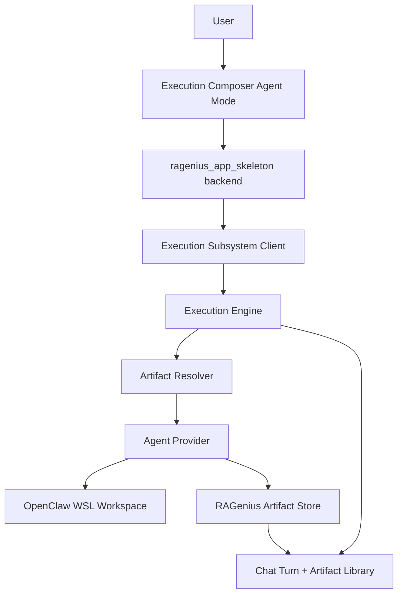
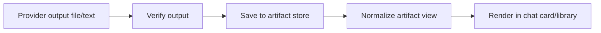

# Agent Mode Artifact Creation And Reuse Design

## Purpose

This design turns `docs/agent-mode-artifact-creation-reuse-contract.md` into an end-to-end implementation model for RAGenius Agent-mode execution turns.

The core UX goal is simple:

```text
Select artifacts + write an agent prompt -> run agent -> get reusable artifacts back
```

The system must keep provider internals hidden from users while still preserving enough diagnostics for debugging.

## Current State

RAGenius already has several necessary pieces:

- Session-scoped Artifact Library
- Execution Composer for tool, skill, and agent turns
- `@exec codex` and `@exec openclaw` routing
- Execution subsystem `execute_agent` dispatch
- OpenClaw provider with WSL bridge and output verification
- Artifact output cards for some execution results

Main gaps:

- Agent mode does not yet submit structured artifact refs.
- `execute_agent` does not yet accept `artifact_refs`.
- `execute_agent` does not yet accept provider-neutral `expected_outputs`.
- OpenClaw provider does not yet stage selected artifacts into its workspace.
- OpenClaw verified outputs are not yet persisted into the RAGenius artifact store.
- Codex/OpenClaw prompt builders do not yet consume selected artifacts through a shared resolver.

## Target Architecture



Responsibilities:

- Frontend selects artifacts and sends ids only.
- App backend preserves session/app context and submits structured refs.
- Execution subsystem validates and resolves refs.
- Provider adapts resolved artifacts to backend-specific context.
- Artifact store owns stable output persistence.
- UI renders normalized artifact records and hides provider-local paths.

## Frontend Design

### Execution Composer Agent Mode

Agent mode layout:

```text
Mode: Agent
Agent Backend: [Codex CLI | OpenClaw CLI]
Execution Mode: [sync | async]

Agent request:
[natural language text area]

Use artifacts:
[ ] Chat Export - Bible observation notes.md
    chat_export | text/markdown | inline text, file backed
[ ] PDF Export - Micah notes.pdf
    google_drive_export | application/pdf | file backed, binary payload

Expected output:
[ ] Save agent output as reusable artifact
Name: [agent-answer.md]
Format: [Markdown]

[Run]
```

Rules:

- Artifact selection uses checkboxes.
- Selected artifacts are displayed in a removable list.
- Incompatible artifacts remain visible with a reason.
- OpenClaw mode shows staging hint, not workspace paths.
- Codex skill hint is shown only for Codex.
- OpenClaw does not show Codex-only skill hints.

### Frontend Submission Shape

Composer submits an object to `runExecutionComposer`, not just a string command:

```ts
type AgentComposerSubmission = {
  commandKind: "agent";
  targetId: "codex_cli" | "openclaw_cli";
  executionMode: "sync" | "async";
  args: {
    request: string;
    skillHint?: string;
    artifactRefs?: AgentArtifactRef[];
    expectedOutputs?: AgentExpectedOutput[];
  };
};
```

The app may still build a user-visible `@exec` command for transcript continuity, but structured fields should travel through the backend path.

## App Backend Design

### Route Parsing

Existing command forms remain valid:

```text
@exec codex "request"
@exec openclaw "request"
@exec async openclaw "request"
```

For Composer-originated submissions, the app should avoid encoding artifact ids in the prompt string. It should attach artifact refs in request metadata.

### Chat Request Extension

Extend the app chat request for execution metadata:

```ts
type ChatRequest = {
  user_id: string;
  app_id: string;
  user_query: string;
  template_version?: number;
  execution_metadata?: {
    artifact_refs?: AgentArtifactRef[];
    expected_outputs?: AgentExpectedOutput[];
  };
};
```

If adding `execution_metadata` to chat request is too broad for the first slice, add a dedicated execution endpoint from the app frontend to app backend. The key rule is unchanged: artifact refs must be structured, not embedded in command text.

### Submit To Execution Subsystem

The app backend submits:

```json
{
  "request_type": "execute_agent",
  "agent_backend": "openclaw_cli",
  "app_id": "app_123",
  "session_id": "session_123",
  "agent_query": "Summarize selected artifacts.",
  "artifact_refs": [],
  "expected_outputs": [],
  "context": {
    "openclaw": {
      "execution_mode": "output_required"
    }
  }
}
```

The app backend should not resolve file paths. It may validate that artifact ids are syntactically present, but ownership and readiness checks belong in the execution subsystem.

## Execution Subsystem Design

### Request Schema

Extend `execute_agent` schema:

- `artifact_refs?: AgentArtifactRef[]`
- `expected_outputs?: AgentExpectedOutput[]`

Keep existing fields:

- `approved_content_id`
- `approved_revision_id`
- `context`

### Artifact Resolver

Add an execution subsystem service:

```ts
class AgentArtifactResolver {
  resolve(input: {
    appId: string;
    sessionId: string;
    refs: AgentArtifactRef[];
    backend: "codex_cli" | "openclaw_cli";
  }): Promise<ResolvedAgentArtifact[]>;
}
```

Resolver steps:

1. Fetch artifact metadata from artifact store/inventory.
2. Confirm artifact app/session ownership.
3. Confirm artifact readiness and reusability.
4. Confirm requested reuse mode is supported.
5. Confirm backend compatibility.
6. Resolve server-side file path or inline content.
7. Apply size/truncation rules.
8. Return `ResolvedAgentArtifact[]`.

The resolver must never trust frontend file paths.

### Expected Output Planner

Add provider-neutral expected output normalization:

```ts
class AgentExpectedOutputPlanner {
  normalize(input: {
    backend: "codex_cli" | "openclaw_cli";
    request: ExecuteAgentRequest;
  }): NormalizedAgentExpectedOutput[];
}
```

Rules:

- If user checks `Save agent output as reusable artifact`, create one required output by default.
- If OpenClaw `context.openclaw.execution_mode = "output_required"` and no expected output exists, generate a default markdown expected output.
- Provider-specific temporary output paths are added by provider adapters, not by the app.

## Provider Design

### Codex Provider

Codex receives:

- natural-language prompt
- resolved artifact context
- expected output instructions

Codex prompt builder should include:

```text
Selected RAGenius artifacts:
1. Chat Export - Bible observation notes.md
   Artifact id: artifact_123
   Reuse mode: inline_text
   Content follows:
   ...

User task:
Summarize these notes into three study questions.
```

If output persistence is requested, Codex can either:

- return text output for the execution subsystem to persist, or
- write to an agreed local output path if a Codex workspace model is later defined

Initial Codex implementation can persist `output_text` as a markdown `agent_output` artifact when requested.

### OpenClaw Provider

OpenClaw receives:

- natural-language prompt
- staged input paths
- required output paths

Provider steps:

1. Stage resolved artifacts into OpenClaw workspace.
2. Build prompt with staged paths.
3. Invoke OpenClaw via WSL bridge.
4. Check provider exit code.
5. Verify required outputs.
6. Persist verified outputs into artifact store.
7. Return normalized result.

OpenClaw prompt example:

```text
You are executing a RAGenius OpenClaw task.
Workspace root: /home/openclaw/.openclaw/workspace
Use only paths inside the workspace root.

Staged inputs:
- artifact_123: /home/openclaw/.openclaw/workspace/inputs/artifact_123.md

Required outputs:
- agent_answer: write exactly to /home/openclaw/.openclaw/workspace/outputs/agent_answer-openclaw-result.md

User task:
Summarize selected artifacts into a reusable markdown output.
```

### OpenClaw Staging

Text artifacts:

- write UTF-8 file into `inputs/`
- verify file exists
- verify byte size
- verify SHA-256

Binary artifacts:

- transfer bytes in chunks
- no shell-interpolated command construction
- verify size and SHA-256 after transfer

Metadata-only artifacts:

- include metadata in prompt
- do not stage full payload

## Output Persistence Design

### Persistence Flow



### Stored Artifact Mapping

Use existing stored artifact fields.

Set:

- `artifact_type = "agent_output"`
- `provider_origin = "openclaw_cli"` or `"codex_cli"`
- `created_by_execution_id = execution_id`
- `display_name = expected_output.display_name`
- `mime_type = expected_output.media_type`

Store provenance/verification in metadata/content:

```json
{
  "source_kind": "agent_execution",
  "source_session_id": "session_123",
  "source_execution_id": "execution_123",
  "agent_backend": "openclaw_cli",
  "provider_output_id": "agent_answer",
  "verification": {
    "output_id": "agent_answer",
    "verified": true,
    "workspace_relative_path": "outputs/agent_answer-openclaw-result.md",
    "size_bytes": 2048,
    "sha256": "..."
  }
}
```

### UI Projection

The app backend normalizes stored records into artifact library rows:

```ts
type AgentOutputArtifactView = {
  artifact_id: string;
  artifact_type: "agent_output";
  display_name: string;
  summary?: string;
  mime_type?: string;
  provider_origin: "codex_cli" | "openclaw_cli";
  routes: {
    open: string;
    preview?: string | null;
    delete: string;
  };
  consumption: {
    default_mode: "file_backed" | "inline_text" | "binary_payload";
    supported_modes: string[];
  };
};
```

## Agent Execution Turn GUI

Agent execution turns should be artifact-first when they produce reusable output.

The main execution turn card should not look like a normal answer card. It should show:

- execution status
- agent backend
- concise user-facing summary
- persisted output artifact cards when available
- runtime controls such as details, refresh, retry, and confirm when needed

Execution turns should not expose raw provider traces in the main chat card. Raw traces belong in the inspector.

### Execution Turn Button Rules

Normal assistant content turns may show:

- `Select for Reuse`
- `Mark Reviewed`
- `Inspect`
- `Sources`

Execution turns may show:

- `Execution Details`
- `Refresh Status`
- `Retry`
- `Confirm Execution` when status is `pending_confirmation`
- `Cancel` only if async cancellation is supported
- artifact actions for persisted outputs:
  - `Preview`
  - `Open Saved File`
  - `Reuse In Composer`
  - `View In Artifact Library`

Execution turns should not show `Mark Reviewed` as a primary action.

If an execution turn has plain text output but no persisted artifact yet, it may show:

- `Create Reuse Artifact`
- `Select for Reuse`

Those fallback actions are secondary and should disappear once the output is persisted as an artifact.

Reason:

- Normal chat turns are content-first.
- Execution turns are runtime/provenance-first.
- Reusable execution outputs should flow through artifacts, not through reviewed-content controls.

### Artifact Cards On Execution Turns

Each persisted output artifact card should show:

- friendly artifact name
- artifact type label, for example `Agent Output`
- provider label, for example `Generated by OpenClaw Agent`
- MIME type
- short summary when available
- primary action: `Reuse In Composer`
- secondary actions: `Preview`, `Open Saved File`, `View In Artifact Library`

Provider-local paths should not appear on the card.

### Reuse In Composer Behavior

Clicking `Reuse In Composer` from an execution output artifact should:

1. Open Execution Composer.
2. Preselect the clicked artifact.
3. Keep the Artifact Library closed unless the user explicitly opens it.
4. Default Composer mode based on the artifact and source context.

Default mode rules:

- If the artifact has a recommended compatible tool, open Composer in `Tool` mode with that tool selected.
- If the artifact has a recommended compatible skill, open Composer in `Skill` mode with that skill selected.
- If the artifact came from an agent output and no stronger recommendation exists, open Composer in `Agent` mode.
- If the action was launched from an Agent execution turn, preserve that backend as the default Agent backend.
- If there is no previous agent backend, default to the user's last-used Agent backend; otherwise default to `Codex CLI`.

The selected artifact should appear as a selected artifact chip or selected row with a `Remove` button.

For multi-artifact reuse:

- Artifact Library can allow selecting multiple artifacts.
- `Use Selected In Composer` opens Composer with all selected artifacts.
- Composer uses checkbox state for available artifacts.
- The selected count should be visible.
- Users can unselect individual artifacts before running.

### Compatibility States In Composer

When Composer opens with a preselected artifact:

- If the selected target/backend is compatible, show the artifact as selected.
- If incompatible, keep the artifact visible but mark it incompatible.
- Show a short reason, for example `Requires binary payload; selected backend only supports inline text`.
- Offer compatible target suggestions when known.
- Do not silently drop a user's selected artifact.

### View In Artifact Library Behavior

Clicking `View In Artifact Library` should:

1. Open the session-scoped Artifact Library.
2. Highlight or scroll to the artifact.
3. Preserve the current chat/inspector layout.

Artifact Library remains session-scoped. It must not show artifacts from other sessions unless a future cross-session permission model is added.

### Execution Turn Empty States

Execution turns should distinguish:

- completed with no reusable artifact
- completed with persisted artifacts
- failed before producing output
- output verified but persistence failed
- pending confirmation
- async pending/running

Recommended messages:

```text
Execution completed. No reusable artifacts were produced.
```

```text
Execution completed and saved 1 reusable artifact.
```

```text
Execution failed before creating reusable output. See Execution Details.
```

```text
Required output was produced but could not be saved as a reusable artifact.
```

## Failure Behavior

Required outputs:

- provider exit non-zero: `failed`
- required output missing: `failed`
- required output verification failed: `failed`
- required output persistence failed: `failed`

Optional outputs:

- optional output missing: `completed` with diagnostics
- optional output persistence failed: `completed` with diagnostics

If `completed_with_warnings` becomes available later, optional failures should map to it.

## Inspector Design

Main chat card shows:

- concise status
- created artifact cards
- retry/refresh/details buttons

Inspector shows:

- raw provider stdout/stderr tails
- provider exit code
- OpenClaw workspace paths
- staging verification details
- artifact persistence details
- truncated inline text diagnostics

Provider-local paths are debug-only.

## Implementation Plan

### Phase 1: Contract-Aligned Request Shape

- Extend execution subsystem `execute_agent` schema with `artifact_refs`.
- Extend execution subsystem `execute_agent` schema with provider-neutral `expected_outputs`.
- Add tests for schema acceptance/rejection.
- Preserve backward compatibility for existing Codex/OpenClaw calls.

### Phase 2: Artifact Resolver

- Add resolver service in `ragenius_execution_subsystem`.
- Enforce `{app_id, session_id}` scope.
- Validate readiness, reusability, reuse mode, and backend compatibility.
- Add tests for rejection cases.

### Phase 3: OpenClaw Staging

- Convert resolved artifacts to staged OpenClaw inputs.
- Add text staging with hash/size verification.
- Add binary staging with chunked verified transfer.
- Update OpenClaw prompt builder to include staged inputs.
- Add provider tests.

### Phase 4: Provider-Neutral Expected Outputs

- Normalize `expected_outputs`.
- Derive OpenClaw workspace output paths internally.
- Fix non-zero OpenClaw exit code handling.
- Verify required and optional output behavior.

### Phase 5: Output Persistence

- Persist verified outputs into the artifact store.
- Map records to existing artifact shape using `provider_origin`.
- Return normalized artifact views.
- Add failure semantics for persistence failures.

### Phase 6: App Backend Integration

- Pass Agent-mode `artifact_refs` and `expected_outputs` to execution subsystem.
- Keep visible `@exec` transcript command clean.
- Add tests for OpenClaw and Codex agent submissions.

### Phase 7: Execution Composer UX

- Add Agent-mode artifact selector.
- Add checkbox multi-select.
- Add remove/unselect selected artifact controls.
- Show backend compatibility and staging hints.
- Add tests for artifact selection and submission.

### Phase 8: Execution Result UX

- Render persisted agent output artifacts in execution turns.
- Add `Preview`, `Open Saved File`, `Reuse In Composer`, and `View In Artifact Library`.
- Apply execution-turn button rules: runtime controls plus artifact actions, not normal-turn review controls.
- Add `Confirm Execution` button for pending confirmation agent turns.
- Add empty states for completed-without-artifact, failed-before-output, and persistence-failed cases.
- Keep full provider trace in inspector only.

### Phase 9: Reuse In Composer UX

- Make execution artifact `Reuse In Composer` open Composer with the artifact preselected.
- Preserve Agent backend when launched from an Agent execution turn.
- Support multi-artifact `Use Selected In Composer` from Artifact Library.
- Show selected artifact chips or rows with `Remove`.
- Preserve incompatible preselected artifacts and show compatibility reasons.
- Add tests for preselection, removal, backend defaulting, and incompatible artifact states.

## Open Questions

- Should Codex output persistence initially persist only final text, or should it support file-backed outputs immediately?
- Should Agent-mode expected outputs be user-configurable in the first GUI slice, or should the first UI only expose `Save agent output as reusable artifact`?
- Should large text artifacts default to `file_backed` instead of `inline_text` once they exceed inline limits?

## Acceptance Criteria

- A user can select artifacts in Agent mode without copying ids.
- OpenClaw receives staged artifact inputs, not RAGenius paths.
- Codex receives structured artifact context, not manual id references.
- Verified OpenClaw outputs become session artifacts.
- Agent output artifacts appear in Artifact Library.
- Agent output artifacts can be reused in later tool, skill, or agent turns.
- Execution turns show runtime controls and artifact actions, not `Mark Reviewed` as a primary action.
- `Reuse In Composer` opens Composer with the clicked artifact preselected.
- Artifact Library can pass one or more selected artifacts into Composer.
- Composer preserves incompatible selected artifacts with an explanation instead of silently dropping them.
- Required output verification or persistence failures fail the execution.
- Optional output failures are visible in inspector diagnostics.
