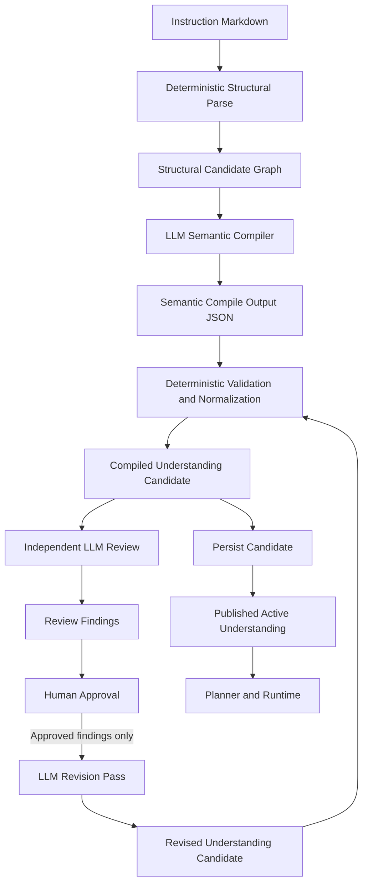

# LLM-Assisted Application-Instruction Compiler And Review-Approve-Revise Design

**Date:** 2026-05-08  
**Status:** Revised draft for review  
**Scope:** `ragenius_app_skeleton` application-instruction understanding pipeline, including initial compilation, advisory review, human-approved revision, validation, persistence, publish, and planner consumption.

## Goal

Replace the current parser-only application-instruction understanding pipeline with a hybrid compiler that combines:
- deterministic structural parsing
- LLM-assisted semantic compilation
- deterministic validation and normalization
- persistent compiled understanding reuse
- independent LLM review
- human-approved revision loop

The target outcome is a compiled application-understanding contract that is:
- more semantically correct than parser-only compilation
- more deterministic and testable than LLM-only interpretation
- inspectable, revisable, and publishable under explicit control
- expressive enough to represent global interaction logic, multi-role apps, routing rules, clarification gates, and ordered sequential module orchestration

## Problem Statement

Application instructions are written in natural language. The current deterministic parser is good at extracting:
- headings
- section hierarchy
- explicit resource filenames
- explicit numbered steps
- some explicit trigger and threshold rules

But it is weak at semantic judgments such as:
- whether a section is a routing rule or a real executable workflow
- whether multiple interaction patterns are peer workflows or only examples
- whether a block is a support module, follow-up module, or supplementary workflow
- whether a workflow is default, or whether there is no default and routing is intent-driven
- whether example questions are actual triggers or illustrations
- whether clarification logic defines required slots or only descriptive guidance
- whether multiple roles exist with different tones/styles and allowed workflows
- whether a top-level section is global interaction logic rather than generic policy
- whether module orchestration is starter-driven, semantic, or assistant-suggested

Current LLM review findings have already proven useful in surfacing these issues.

## Design Principles

1. **Structure first, semantics second**
- heading tree and explicit extraction remain deterministic

2. **LLM is constrained, not freeform**
- LLM consumes structured candidates and emits schema-constrained JSON

3. **Compiled understanding remains authoritative**
- runtime uses validated compiled understanding, not raw LLM prose

4. **Review is independent from compile**
- compilation and review must be separate judgments

5. **Human approval gates revision**
- review findings do not auto-correct production understanding

6. **No forced default workflow assumption**
- some apps have one default workflow, some have multiple intent-routed workflows and no default

7. **Interaction logic is first-class**
- user interaction behavior is not collapsed into generic policy text

8. **Routing may select more than workflows**
- routing may choose role, workflow, module, supplementary workflow, or interaction/style profile

9. **Multi-module orchestration is ordered and sequential only**
- when multiple modules match, execution proceeds in deterministic order, one by one

10. **Every stage is versioned and persisted**
- compile, review, approval, revision, publish, and status state are explicit

## Non-Goals

This design does not:
- replace `rag_subsystem` retrieval logic
- redesign file-backed instruction storage
- make runtime planning fully LLM-driven
- allow unconstrained LLM self-correction without validation
- remove deterministic parsing and validation
- require Builder UI implementation in this spec
- implement arbitrary parallel module graphs or unconstrained dependency graphs

## Core Assumptions About Instructions

### Structural assumptions

1. application instructions are hierarchical documents
2. heading depth carries ownership
3. top-level structure is recoverable deterministically
4. explicit filenames, ordered lists, and explicit IF/THEN style rules can often be extracted safely
5. instruction understanding is stable enough to compile, persist, and reuse across sessions

### Semantic assumptions

1. parser-only extraction is necessary but not sufficient
2. semantic block-role classification often requires LLM judgment
3. review and revision are needed because first-pass semantic compilation can still be wrong
4. a human may need to approve only part of the review findings before revision

### Functional-block assumptions

The design assumes application instructions can be normalized into a finite set of first-class functional blocks:
- `global_app_contract`
- `interaction_logic`
- `role_profile`
- `routing_rule`
- `module_orchestration`
- `primary_workflow`
- `entry_mode`
- `support_module`
- `followup_module`
- `supplementary_workflow`
- `clarification_gate_rule`
- `resource_catalog`
- `output_contract`

## High-Level Pipeline



## Stage 1: Deterministic Structural Parse

### Inputs
- `instructions/{app_id}/instructions.md`
- app-scoped builder documents
- structural parser version

### Responsibilities
- determine top-level heading depth (`#` or `##`)
- strip heading markers from titles
- build heading tree with parent/child ownership
- extract explicit text sections
- extract explicit step candidates from:
  - numbered list items
  - heading-style steps like `### Step N:`
- extract explicit filenames and resource mentions
- extract explicit thresholds and gate rules where pattern-safe
- extract explicit role/tone/style candidate sections where structurally visible
- produce a structural candidate graph, not final semantics

### Structural Candidate Output

```json
{
  "heading_tree": [],
  "section_candidates": [],
  "step_candidates": [],
  "resource_candidates": [],
  "rule_candidates": [],
  "trigger_candidates": [],
  "role_candidates": [],
  "interaction_logic_candidates": [],
  "parser_warnings": []
}
```

This output is deterministic and cacheable.

## Stage 2: LLM-Assisted Semantic Compilation

### Purpose

Interpret the structural candidate graph semantically and emit a schema-constrained draft understanding.

### Compiler Input Contract

The LLM compiler receives:
- app metadata
- full instruction text
- heading tree
- structural candidate graph
- extracted resource candidates
- parser warnings
- optionally previous published compiled understanding for incremental compile
- optionally approved prior revision hints

### Compiler Prompt Contract

The compiler prompt must instruct the model to:
- classify candidate sections into semantic roles
- distinguish `global_app_contract` from `interaction_logic`
- identify role profiles and role-specific tone/style/constraints
- identify executable workflows vs routing rules vs module orchestration vs policies
- detect whether the app has:
  - one default workflow
  - multiple intent-routed workflows with no default
  - supplementary workflows
- detect clarification gates and slot thresholds when described explicitly
- detect bundled execution phases vs interactive checkpoints
- identify module orchestration rules, including:
  - semantic module selection
  - starter independence
  - assistant-suggested modules
  - ordered sequential multi-module execution
- emit only JSON matching schema
- never invent filenames not present in the source or builder docs
- mark uncertainty explicitly instead of guessing silently

## Semantic Compile Schema

```json
{
  "app_semantic_model": {
    "primary_service_mode": "single_default_workflow | intent_routed_multi_workflow | mixed",
    "default_workflow_id": null,
    "global_app_contract": {},
    "interaction_logic_blocks": [],
    "role_profiles": [],
    "routing_rules": [],
    "module_orchestration": null,
    "service_blocks": [],
    "procedures": [],
    "procedure_steps": [],
    "clarification_gate_rules": [],
    "resource_bindings": [],
    "semantic_warnings": [],
    "semantic_confidence": 0.0
  }
}
```

### Global App Contract Schema

```json
{
  "mission": "string | null",
  "objective": "string | null",
  "constraints": ["string"],
  "security_rules": ["string"],
  "boundaries": ["string"],
  "global_defaults": {
    "default_role_id": "string | null",
    "default_tone_style": "string | null"
  },
  "confidence": 0.0
}
```

### Interaction Logic Schema

```json
{
  "logic_id": "string",
  "scope": "global | workflow | step",
  "title": "string",
  "source_section_id": "string",
  "applies_to_ids": ["string"],
  "rules": [
    {
      "rule_type": "ask_wait_progress | clarification_behavior | response_handling | stop_continue | pacing | safety_escalation",
      "expression": "string"
    }
  ],
  "confidence": 0.0
}
```

### Role Profile Schema

```json
{
  "role_id": "string",
  "name": "string",
  "purpose": "string | null",
  "tone_style": ["string"],
  "constraints": ["string"],
  "allowed_workflow_ids": ["string"],
  "allowed_module_ids": ["string"],
  "default_for_intents": ["string"],
  "confidence": 0.0
}
```

### Service Block Schema

```json
{
  "block_id": "string",
  "block_type": "primary_workflow | entry_mode | support_module | followup_module | supplementary_workflow | resource_catalog | output_contract",
  "title": "string",
  "source_section_id": "string",
  "is_default": false,
  "linked_procedure_id": "string | null",
  "required_inputs": ["string"],
  "resource_refs": ["string"],
  "notes": "string | null",
  "confidence": 0.0
}
```

### Procedure Schema

```json
{
  "procedure_id": "string",
  "title": "string",
  "service_block_id": "string",
  "procedure_kind": "workflow | support | followup | supplementary",
  "selection_mode": "default | explicit_trigger | intent_routed | delegated_from_rule",
  "entry_rule_ids": ["string"],
  "interaction_logic_ids": ["string"],
  "output_contract_ids": ["string"],
  "confidence": 0.0
}
```

### Procedure Step Schema

```json
{
  "step_id": "string",
  "procedure_id": "string",
  "order": 0,
  "title": "string",
  "body_text": "string",
  "execution_mode": "interactive | bundled",
  "bundled_step_ids": ["string"],
  "bundled_resource_refs": ["string"],
  "wait_for_user": false,
  "interaction_logic_ids": ["string"],
  "resource_refs": ["string"],
  "support_module_ids": ["string"],
  "clarification_gate_rule_id": "string | null",
  "confidence": 0.0
}
```

### Routing Rule Schema

```json
{
  "rule_id": "string",
  "title": "string",
  "source_section_id": "string",
  "rule_kind": "intent_routing | role_selection | workflow_selection | module_selection | supplementary_selection | style_selection | mode_switch | escalation",
  "conditions": [
    {
      "condition_type": "keyword | semantic_intent | threshold | explicit_rule | session_state",
      "expression": "string"
    }
  ],
  "outcomes": [
    {
      "outcome_type": "select_role | select_workflow | select_module | select_supplementary_workflow | select_style_profile | go_to_step | ask_clarification | stop",
      "target_id": "string | null"
    }
  ],
  "confidence": 0.0
}
```

### Module Orchestration Schema

```json
{
  "orchestration_id": "string",
  "selection_mode": "semantic | trigger_based | mixed",
  "starter_required": false,
  "assistant_suggestion_allowed": true,
  "allow_multi_module": true,
  "composition_mode": "ordered_sequential",
  "task_module_mappings": [
    {
      "mapping_id": "string",
      "task_pattern": "string",
      "target_module_id": "string",
      "priority": 0,
      "sequence_order": 0,
      "stop_condition": "wait_for_user | output_complete | continue"
    }
  ],
  "confidence": 0.0
}
```

### Clarification Gate Rule Schema

```json
{
  "gate_rule_id": "string",
  "procedure_id": "string",
  "clarification_step_id": "string",
  "completion_step_id": "string",
  "slot_policy": {
    "mode": "threshold | explicit_required_slots",
    "minimum_filled_slots": 0,
    "required_slots": ["string"],
    "optional_slots": ["string"]
  },
  "slot_definitions": [
    {
      "slot_name": "string",
      "evidence_examples": ["string"],
      "priority": 0
    }
  ],
  "confidence": 0.0
}
```

## Stage 3: Deterministic Validation And Normalization

### Purpose

Reject malformed or contradictory LLM compile output and produce a canonical runtime contract.

### Validation Rules

#### Structural Integrity
- every referenced id must exist
- exactly one active published compiled understanding per app/version
- no duplicate ids in the same semantic graph

#### Global Contract Integrity
- mission/objective may be null but must not conflict with hard boundaries or security rules
- global defaults may not reference unknown roles or workflows

#### Role Integrity
- role profiles must have unique ids and names
- `allowed_workflow_ids` and `allowed_module_ids` must reference known blocks or procedures
- role-specific tone/style may coexist with global defaults

#### Workflow Semantics
- if `primary_service_mode = single_default_workflow`, there must be exactly one default workflow
- if `primary_service_mode = intent_routed_multi_workflow`, `default_workflow_id` must be null
- if there is no default workflow, at least one routing rule must select among peer primary workflows
- a routing rule cannot also be published as a primary workflow
- a supplementary workflow cannot be default

#### Interaction Logic Integrity
- `interaction_logic` is not itself a workflow or module
- scoped interaction logic must reference valid target ids
- top-level interaction logic without explicit scope normalizes to `global`

#### Module Orchestration Integrity
- only `ordered_sequential` multi-module composition is allowed in this design
- orchestration target modules must reference known `support_module` or `followup_module` blocks
- sequence order must be unique among mappings that can chain in the same orchestration set
- if `starter_required = false`, mappings may be activated from ordinary user intent or session content

#### Step Semantics
- step orders must be unique per procedure
- bundled entry step must include itself in `bundled_step_ids`
- bundled member steps may not declare themselves independent bundled entries in the same procedure
- `interactive` and `bundled` execution modes must be explicit after normalization

#### Clarification Gate Integrity
- threshold mode must have either `minimum_filled_slots > 0` or non-empty required slots
- `clarification_step_id` and `completion_step_id` must both belong to the same procedure
- completion target must not be before clarification step order
- explicit threshold rules like `IF provided_variables >= 3` should be preserved as normalized gate rules when structurally extracted

#### Resource Integrity
- resource references must map to known builder documents or known explicit resource candidates
- phantom resources with null document binding may remain only as `unresolved_resource_warnings`, not active runtime resources
- unresolved resources are warnings unless explicitly marked critical by policy

#### Trigger Integrity
- example questions must not be accepted as triggers unless the compiler marks them as explicit activation examples and validation allows that source section type

### Normalized Runtime Contract

```json
{
  "compiled_instruction_understanding": {
    "compiler_mode": "hybrid_semantic_compile",
    "compiler_versions": {
      "structural_parser_version": "string",
      "semantic_compiler_version": "string",
      "normalizer_version": "string"
    },
    "full_instruction_text": "string",
    "heading_tree": [],
    "instruction_runtime_model": {
      "global_app_contract": {},
      "interaction_logic_blocks": [],
      "role_profiles": [],
      "routing_rules": [],
      "module_orchestration": null,
      "instruction_service_blocks": [],
      "instruction_procedures": [],
      "procedure_steps": [],
      "clarification_gate_rules": [],
      "resource_bindings": [],
      "instruction_resources": [],
      "output_contracts": [],
      "validation_warnings": []
    },
    "default_workflow_inference": null,
    "compile_confidence": 0.0,
    "compile_warnings": []
  }
}
```

## Stage 4: Independent LLM Review

### Purpose

A second LLM critiques the compiled result independently from the compiler.

### Review Input Contract
- raw instruction text
- compiled understanding
- structural candidates
- validation warnings

### Review Prompt Contract
The review model must answer:
- what is likely misclassified
- whether default-workflow semantics are correct, including `no default` cases
- whether routing rules, role selection, and workflows were separated correctly
- whether interaction logic was extracted distinctly from global contract text
- whether role profiles and tone/style mappings are plausible
- whether module orchestration, starter independence, assistant suggestion, and sequential composition are plausible
- whether clarification gate rules are plausible
- whether resources are real, missing, or phantom
- what confidence level applies to the overall compile

### Review Output Schema

```json
{
  "review_status": "reviewed_ok | reviewed_with_warnings | review_failed",
  "review_confidence": 0.0,
  "review_findings": {
    "critical": [],
    "major": [],
    "minor": [],
    "approved_context": {}
  },
  "review_summary_md": "string",
  "review_recommendations": {
    "revise": [],
    "manual_attention": []
  }
}
```

## Stage 5: Review-Approve-Revise

### Human Approval Model

A person reviews findings and marks each as one of:
- `approve`
- `reject`
- `modify`
- `manual_only`

### Approval Record Schema

```json
{
  "approval_session_id": "string",
  "app_id": "string",
  "compiled_record_id": "string",
  "review_record_id": "string",
  "approved_findings": [
    {
      "finding_id": "string",
      "decision": "approve | reject | modify | manual_only",
      "approved_revision_note": "string | null"
    }
  ],
  "approver": "string | null",
  "approved_at": "datetime"
}
```

### Revision Prompt Contract

The revision LLM receives:
- current compiled understanding
- raw instruction text
- approved findings only
- explicit instruction to revise only approved areas
- existing ids where possible
- strict no-invention rule for resources and procedures

### Revision Output Schema

```json
{
  "revised_semantic_model": {},
  "revision_notes": [],
  "preserved_ids": [],
  "changed_ids": [],
  "revision_confidence": 0.0
}
```

The revised output then re-enters deterministic validation and normalization.

## Persistence Model

### Records

#### Compiled Candidate
- `compiled_record_id`
- `app_id`
- `instruction_source_hash`
- `structural_parser_version`
- `semantic_compiler_version`
- `normalizer_version`
- `compiled_contract_json`
- `compile_confidence`
- `compile_status`

#### Review Record
- extend current review persistence with compiler/revision provenance fields

#### Approval Record
- new persistence for approved findings

#### Revision Candidate Record
- separate from original compile until published

### Publish Model

Only one record is active for runtime use.
A revised compile becomes active only after:
- validation success
- optional human publish action

## Planner Contract Impact

The planner must stop compensating for weak compilation and instead consume explicit compiled semantics.

### Planner should consume
- `global_app_contract`
- `interaction_logic_blocks`
- `role_profiles`
- `routing_rules`
- `module_orchestration`
- `clarification_gate_rules`
- `selection_mode`
- `execution_mode`
- `bundled_step_ids`
- explicit `default_workflow_id` or explicit absence of default

### Planner should support
- apps with a default workflow
- apps with no default workflow and intent-routed peer workflows
- routing that selects role and workflow together
- routing that selects module sequences by mapping matrix
- ordered sequential module execution only
- interaction logic at global, workflow, and step scope

### Planner should stop inferring heuristically
- whether a section is a workflow vs routing rule
- whether there is a default workflow in ambiguous cases
- field-specific clarification completion like `audience + theme/passage`
- bundled-step ownership from only title keywords
- role choice from hardcoded app-specific assumptions

## Reliability Analysis

### Benefits
- fewer brittle planner heuristics
- better natural-language interpretation of app instructions
- more correct workflow/module/role classification
- explicit human correction path
- persistent, inspectable understanding

### Risks
- LLM nondeterminism
- schema drift if prompts are too loose
- increased compile complexity and cost
- possibility of compiler and reviewer sharing the same bias

### Mitigations
- strict schema validation
- separate compiler and reviewer prompts
- optional different models for compile and review
- persisted provenance and confidence
- human-approved revision gate
- deterministic fallback to parser-only candidate when semantic compile fails

## Migration Path From Current Parser

### Phase 1: Parallel Semantic Compile
- keep current parser as structural extractor and current runtime compiler
- add semantic compiler in shadow mode
- persist semantic compile candidate but do not publish it to planner
- compare parser-only compiled contract vs hybrid semantic compiled contract

### Phase 2: Review-Only Semantic Comparison
- run independent review against both outputs on selected apps
- measure where hybrid compile improves correctness

### Phase 3: Validator-Hardened Hybrid Publish For Opt-In Apps
- allow specific apps to opt into hybrid semantic compile
- planner consumes published hybrid compiled understanding only for opted-in apps

### Phase 4: Human Approval And Revision
- enable approve/revise workflow for apps whose review findings need correction before publish

### Phase 5: Default Hybrid Compiler
- once stable, make hybrid semantic compile the default pipeline
- keep parser-only fallback for failure mode and regression safety

## Minimum Viable Rollout

### MVP should include
1. deterministic structural parse output
2. semantic compiler prompt + schema
3. validation layer
4. persisted hybrid compiled understanding candidate
5. independent review output
6. approval record model
7. revision prompt + validation loop
8. app-level publish switch between current compiled understanding and hybrid candidate

### MVP should not require initially
- Builder UI editing of compiled JSON
- automated self-publish
- multi-reviewer consensus
- per-app custom prompts beyond standard prompt variables
- generalized parallel module graphs

## Concrete Recommendation

Build this as a hybrid compiler pipeline, not as an LLM replacement for the parser.

The right sequence is:
1. retain current heading-tree parser as structural extractor
2. add semantic compiler schema and prompt
3. add validation-normalization layer
4. adapt current review persistence to operate on the new hybrid compile
5. add approval and revision records
6. let planner consume only published compiled understanding

## Success Criteria

The design is successful when:
- apps like `Grow With Children` compile into multiple intent-routed primary workflows without a false default
- routing rules are not promoted to primary workflows
- interaction logic is represented explicitly rather than buried in generic policy
- role profiles with tone/style and allowed workflows/modules are compiled correctly
- module orchestration from mapping matrices supports starter-independent, ordered sequential execution
- phantom resources are downgraded to warnings rather than active runtime resources
- clarification gate rules are explicit in compiled understanding
- planner removes field-specific transition heuristics and uses compiled semantics instead
- review findings can be selectively approved and applied through a controlled revision loop
